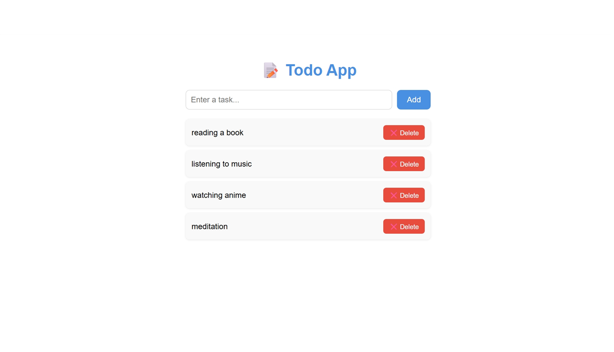

# 📝 Todo Full Stack App

A simple full stack Todo application built with React and Node.js

## 🛠️ Tech Stack
- Frontend: React.js
- Backend: Node.js + Express
- API: REST API

## ✨ Features
- ✅ Add new tasks
- ❌ Delete tasks
- 🔄 Real-time updates

## 🚀 How to Run

### Backend
cd server
node index.js

### Frontend
cd client
npm start

## 🌐 App runs on
- Frontend: http://localhost:3000
- Backend: http://localhost:5000
## 📸 Screenshots

### 🌐 Todo App
